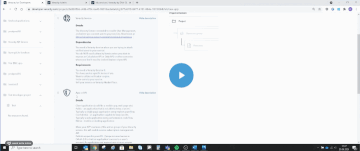

# Creating your service page and go live
When your service is at a mature stage, and you are ready to present it or sell it on our marketplace you have two options:  
* Download marketplace [content form](https://veracity-static.azureedge.net/docs/marketplace/Ver_Marketplace_Guide_ServiceContentForm_2021_09.docx) and send it back to us with content and media requested, so that we can create a marketplace page for you;
* Upload content for the presentation of the service yourself, through our Sanity content platform. Contact us to <onboarding@veracity.com> for more guidance.

In both cases, we also suggest that you read this online guideline and that you familiarize yourself with the different product pages at [store.veracity.com](https://store.veracity.com)

## Sanity tutorial
Watch this tutorial to learn how to edit your product page. To get access to Sanity, contact <onboarding@veracity.com>.

## Writing content
When deciding the name of your service, and when writing content, you should think about being user-friendly and choosing the right words for SEO (Search Engine Optimization). Both in the name of the service and in the content it’s important to:
* Write what the service is about in a simple and short way. 
* Avoid using abbreviations, and if needed explain what the abbreviation means. 
* Write in a user-friendly way so that also non-expert customers can understand – our pages are targeted also at businesspeople and non-engineers.
* Do research about the most typical words used by your target group - we suggest [trends.google.com](https://trends.google.com) as a smart tool to get insight into words used in search (e.g. If your users are more exposed to the word “ship”, use that instead of vessel).

## Service card 
Your service page will be accessed by clicking on a service card in the marketplace home. The text on the service card will be the same as the subtitle at the top of the service page and it should be short and to the point (max 100 characters).
Write what you sell and why it is relevant to the user in a few words. Read the text out loud with your stakeholders to test if they understand what you sell.

Good examples:
Forecaster — Real-time, 24/7 predictions of wind, solar and power demand for a single plant, a fleet, or a whole market.
FuelBoss — Digital and collaborative platform connecting LNG fuel suppliers and ship owners.

<figure>
	
	<figcaption>Service card examples</figcaption>
</figure>
 
## Service key benefits
The Marketplace product page shows three key benefits of your service. They are represented with an icon and a short text paragraph. When you present the benefits, be concise, and state what your unique value proposition is. Ensure the reader understands how your product stands out from your competitors offer.

<figure>
	
	<figcaption>Example of service key benefits </figcaption>
</figure>

## Overview section
Use this section to describe your service or product:
* Explain its main functionalities.
* Avoid using technical language.
* Add videos or images to show your potential customers what your product looks like and how it works.
* Make sure that your text is between three to five paragraphs long.

<figure>
	
	<figcaption>Overview section example</figcaption>
</figure>

## Details section
This section must be shown for services that are sold digitally and show a Buy now button. While the overview section above tells the good marketing story of your product, the "Details" section is focusing on the scope of the service and all the details of the purchase. Keep in mind that this defines the scope of the digital contract that the customer click-accepts when doing a digital purchase.  

In this section, it is mandatory to fill in at least one paragraph and we suggest starting with "Service description" which presents the scope. In addition to this, you should fill in other details like “Delivery”, “Payment options” and “Technical requirements”. The "Country availability" paragraph will be there too, as interested customers can check ahead to see if the service is sold in their country. The Usage and Terms paragraph will always be shown with the link to T&C. You should also add other relevant legal documents (eg. Service Level Agreement, Open-Source Software licensing terms, Data Processing Agreement).

<figure>
	
	<figcaption>Details section example</figcaption>
</figure>